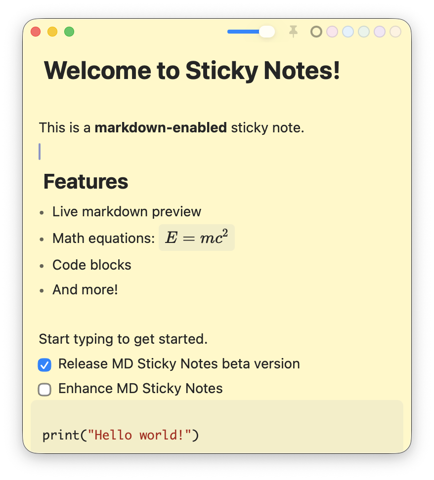

# MD Sticky Notes

A native macOS sticky note app with Obsidian-style markdown live preview, built with Swift and CodeMirror 6.


## Features

### Markdown Editor
- **Live Preview**: Obsidian-style WYSIWYG editing with instant rendering
- **GFM Support**: Tables, strikethrough, task lists, and more
- **Syntax Highlighting**: 15+ programming languages in code blocks
- **Math Rendering**: KaTeX support for inline (`$...$`) and block (`$$...$$`) equations

### Sticky Note Experience
- **Floating Windows**: Always visible while you work
- **Pin on Top**: Keep important notes above all windows (Cmd+Shift+P)
- **Multiple Colors**: Yellow, pink, blue, green, purple, orange
- **Adjustable Opacity**: Transparency slider for each note
- **Auto-Save**: Never lose your notes

### Keyboard Shortcuts
| Shortcut | Action |
|----------|--------|
| Cmd+N | New note |
| Cmd+Shift+P | Pin on top |
| Cmd+B / I / K | Bold / Italic / Link |
| Cmd+F | Find in note |
| Cmd+Shift+F | Find and replace |
| Cmd+` | Cycle through notes |

## Installation

### Download
1. Download [`MDStickyNotes.dmg`](https://github.com/jaesuny/markdown-sticky-notes/releases/download/v1.0.0/MDStickyNotes.dmg)
2. Open the DMG and drag the app to Applications
3. **First launch** — macOS will block the app since it is not notarized. To allow it:
   1. Double-click the app — macOS will show a warning and block it
   2. Open **System Settings** (시스템 설정)
   3. Go to **Privacy & Security** (개인정보 보호 및 보안)
   4. Scroll down to find the message about "StickyNotes" being blocked
   5. Click **"Open Anyway"** (확인 없이 열기)
   6. Click **"Open"** (열기) in the confirmation dialog
   7. After the first launch, you can open it normally

> **Disclaimer**: This app is not notarized by Apple. By downloading and running this app, you acknowledge that you do so at your own risk. The developer assumes no liability for any issues that may arise from its use.

### Build from Source
```bash
# Prerequisites: macOS 12+, Swift 5.9+, Node.js 18+

# Clone and build
git clone https://github.com/jaesuny/markdown-sticky-notes.git
cd markdown-sticky-notes
cd editor-web && npm install && cd ..
./build-app.sh

# Run
open build/StickyNotes.app
```

## Screenshots



## Technical Details

### Architecture
- **Swift/SwiftUI**: Native macOS app shell with NSPanel windows
- **WKWebView + CodeMirror 6**: High-performance markdown editor
- **KaTeX**: Fast LaTeX math rendering
- **Hybrid Approach**: Native performance with battle-tested web editor

### Why Hybrid?
- Pure native markdown editors require months of TextKit work
- Electron is too resource-heavy
- WKWebView is built into macOS with zero external dependencies
- CodeMirror 6 is the most advanced web editor available

## Development

```bash
# Full rebuild (Swift + JS)
./build-app.sh && open build/StickyNotes.app

# JS-only fast iteration
cd editor-web && npm run build && \
  cp dist/editor.bundle.js ../build/StickyNotes.app/Contents/Resources/Editor/ && \
  open ../build/StickyNotes.app
```

## License

MIT

## Credits

- Built with [Claude Code](https://claude.ai/code)
- Editor powered by [CodeMirror 6](https://codemirror.net/)
- Math rendering by [KaTeX](https://katex.org/)
